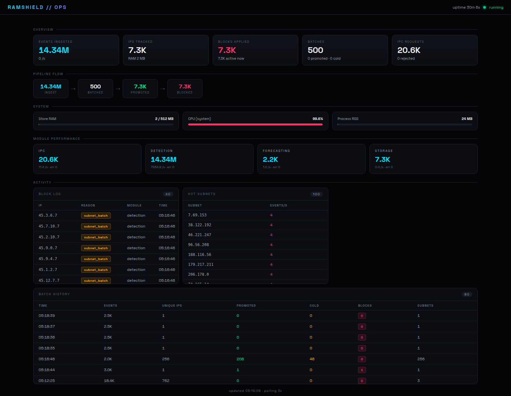
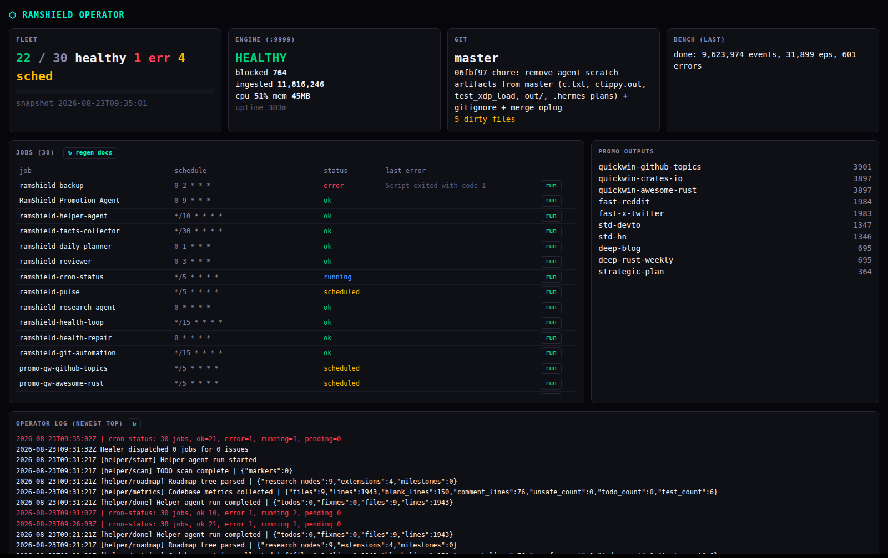

<h1 align="center">🛡️ RamShield</h1>

<p align="center">
  <strong>RAM-first DDoS detection &amp; mitigation engine with kernel-space XDP enforcement.</strong><br>
  Detect · Decide · Enforce — from a single static binary.
</p>

<p align="center">
  <a href="https://crates.io/crates/ramshield"></a>
  <a href="https://github.com/grep999/ramshield/actions/workflows/ci.yml"></a>
  <a href="https://github.com/grep999/ramshield/actions/workflows/clippy.yml"></a>
  <a href="https://codecov.io/gh/grep999/ramshield"></a>
  <a href="https://github.com/grep999/ramshield/blob/main/LICENSE"></a>
  
  <a href="https://docs.rs/ramshield/latest"></a>
</p>

## Why RamShield

Edge proxies see attacks. They don't know what to *do* about them.
RamShield is the decision point between your reverse proxy and your origin:

- **Detects** volumetric, protocol and application-layer abuse in real time — EWMA rate tracking, /24 subnet correlation, Holt-Winters forecasting, payload-entropy analysis
- **Decides** on mitigation using batched evaluation over sharded in-memory state
- **Enforces** via IPC answers to your proxy — or drops packets **in the kernel** through an eBPF/XDP program before they ever reach userspace
- **Survives** crashes: WAL-first commit log replays live blocks back into store + XDP on restart

One binary. No external services. No GC pauses. Hard memory ceiling enforced by design.

<p align="center">
  <a href="docs/screenshots/dashboard.png"></a>
</p>
<p align="center"><em>Live ops dashboard: ingest → batch → promote → block pipeline, block log, /24 subnet heat.</em></p>

```
nginx / HAProxy / Envoy ──batch──► RamShield ──check──► allow / deny
                                      │
                                      ▼ (optional, CAP_NET_ADMIN)
                                XDP eBPF kernel-space drop
```

---

## Features

| | | |
|---|---|---|
| **:brain: Six detection signals** | EWMA rate · inst-rate CUSUM · subnet batch (distinct-IP keyed) · Holt-Winters anomaly · SPOT-lite tail alarm · Shannon entropy — composite threat score |
| **:nut_and_bolt: Kernel enforcement** | Optional aya-based XDP program drops blocked IPs in kernel space |
| **:floppy_disk: Crash-durable state** | WAL-first commit (append → mutate → XDP). Restart replays live blocks automatically; TTL-aware; segment retention with pruning |
| **:package: Single binary** | Static build, zero runtime dependencies, JSON-over-TCP integration from any language |
| **:bar_chart: Live observability** | Dark ops dashboard + Prometheus-compatible metrics export + autonomous operator console |
| **:lock: Hardened surface** | HMAC frame auth, Argon2 dashboard login, hard memory ceiling — `CapacityExceeded` as a Result, never a panic |

<details>
<summary><b>Full feature list</b></summary>

### Detection & Mitigation
- **EWMA rate tracking** per IP with configurable thresholds
- **Inst-rate CUSUM** — capped cumulative-sum burst detector with warm-up allowance (no cold-start false positives)
- **Subnet batch blocking** — automatic /24 blocks keyed on *distinct* source IPs, so one noisy host can't take down its neighborhood
- **Holt-Winters forecasting** — preemptive blocks on anomaly z-score
- **SPOT-lite tail alarm** — empirical extreme-quantile estimation for heavy-tailed traffic
- **Entropy analysis** — detects botnet uniformity across subnets
- **Threat scoring** — composite of RPS, error rate, and history

### Enforcement Pipeline
- **Idempotent operations** — UUID `decision_id` prevents replay
- **WAL crash durability** — WAL-first commit, startup replay restores live blocks into store + XDP, TTL-expired entries skipped, segment retention with oldest-first pruning
- **TTL wheel** — automatic expiry without background scans
- **XDP integration** — targeted insert/remove on BPF hash map, full sync at boot

### Integration & Observability
- **JSON over TCP** line protocol — integrate from nginx/Lua, Go, Python, anything
- **HMAC-SHA256 frame auth** — optional shared-secret authentication per IPC frame
- **Batch endpoint** — `report_connections` for high-throughput edge proxies
- **HTTP dashboard** — real-time metrics, block feed, subnet heat; Argon2 admin login
- **Prometheus-compatible** — `/metrics` endpoint and `Metrics::emit_prometheus()`
- **Structured logging** — `tracing` with `RUST_LOG` filtering

</details>

---

## Quick Start

```bash
git clone https://github.com/grep999/ramshield
cd ramshield/beta/rs
cargo build --release -F full

# run (dashboard :9999, IPC :7890)
./target/release/ramshield config.toml
```

```bash
# health check
curl -s http://127.0.0.1:9999/healthz          # {"status":"ok"}

# ask about an IP
echo '{"type":"check_ip","ip":"203.0.113.7"}' | nc -q1 127.0.0.1 7890
# → {"type":"ip_status","ip":"203.0.113.7","blocked":false,"threat":0.0,...}
```

### Drive it with the attack simulator

```bash
python3 scripts/attack_nexus.py profiles list          # 6 attack classes + chain
python3 scripts/attack_nexus.py run --profile l7_http_flood --duration 30
python3 scripts/attack_nexus.py run --profile red_team_full   # 6-phase chain
```

Watch blocks appear live at `http://localhost:9999`.

<p align="center">
  <a href="docs/screenshots/operator_console.png"></a>
</p>
<p align="center"><em>Operator console: autonomous agent fleet (30 cronjobs), engine health, attack-bench results, live ops log.</em></p>

### CLI

```bash
./target/release/ramshield-cli stats
./target/release/ramshield-cli check 1.2.3.4
./target/release/ramshield-cli block 1.2.3.4 --reason manual --ttl 3600
```

---

## Configuration

```toml
[engine]
shard_count = 256          # DashMap shards (power of 2)
ram_limit_mb = 512         # hard memory ceiling — CapacityExceeded beyond it

[detection]
rps_threshold = 1000       # EWMA RPS block trigger
promote_min_events = 8     # hits before full IpRecord promotion
subnet_window_threshold = 500  # /24 volume for subnet block
batch_max_events = 4096    # batch flush size
batch_window_ms = 50       # max batch wait

[forecasting]
enabled = true
anomaly_zscore = 2.5       # Holt-Winters z-score threshold
min_entropy = 2.0          # Shannon entropy floor (bits)

[ipc]
tcp_addr = "127.0.0.1:7890"
max_connections = 256

[wal]                      # crash-durable block state (off by default)
enabled = true
dir = "/var/lib/ramshield/wal"
durability = "Flush"       # None | Flush | Fsync | GroupCommit (= Fsync today)
compress = true            # LZ4 records > 64 B
seg_max_bytes = 67108864   # 64 MB segment rotation
retention_max_bytes = 536870912  # 512 MB total cap; oldest pruned (0 = ∞)

[xdp]                      # optional kernel acceleration
enabled = false
interface = "eth0"
build_mode = "auto"        # auto | rust | clang | stub
```

Every field is also env-overridable: `RAMSHIELD_ENGINE__RAM_LIMIT_MB=2048`.

**WAL recovery semantics:** every block/unblock is journaled *before* state mutation.
On restart the log is folded in LSN order — live blocks are restored into the store
and re-armed in XDP by reconciliation, unblocks cancel earlier blocks, expired TTLs
are skipped.

---

## Architecture

```
┌─────────────┐     ┌─────────────────────────────────────────────────┐
│  Edge /     │     │              ramshield daemon                   │
│  Proxies    │────►│                                                 │
│  (nginx,    │     │  ┌──────────┐    ┌──────────────────────┐     │
│   HAProxy,  │     │  │  Engine  │───►│  DetectionEngine     │     │
│   Envoy)    │     │  └────┬─────┘    │  (batch processor)   │     │
└─────────────┘     │       │         └──────────┬───────────┘     │
                    │       ▼                    ▼                 │
                    │  ┌──────────┐    ┌──────────────────────┐     │
                    │  │  Store   │◄───│  Forecaster          │     │
                    │  │ (DashMap)│    │  (Holt-Winters +     │     │
                    │  └──────────┘    │   Entropy)           │     │
                    │       ▲          └──────────┬───────────┘     │
                    │       │                     │                 │
                    │       │    BlockDecision    │                 │
                    │  ┌────┴───────┐             │                 │
                    │  │ Enforcement│             │                 │
                    │  │ (sole      │──► WAL      │                 │
                    │  │  writer)   │    (durable)│                 │
                    │  └────┬───────┘             │                 │
                    │       ▼                     │                 │
                    │  ┌──────────┐    ┌──────────────────────┐     │
                    │  │ XDP Mgr  │───►│  eBPF/XDP Program    │     │
                    │  └──────────┘    │  (kernel space)      │     │
                    └─────────────────────────────────────────────────┘
```

**Design principles:** RAM-first hot path (sharded `DashMap`) · batch-first
evaluation (50 ms / 4096-event windows amortize lock costs) · cold-event bloom
filter before promotion · subnet-scale counters catch distributed floods early ·
single-writer enforcement (all mutations through one actor, WAL-first).

Workspace layout: `binary glue in src/` + nine domain crates
(`config`, `detection`, `enforcement`, `forecasting`, `metrics`, `protocol`,
`storage`, `types`, `xdp`). Edition 2024.

<details>
<summary><b>IPC protocol reference</b></summary>

Transport: TCP, one JSON object per `\n`-terminated line.

| Request | Purpose |
|---------|---------|
| `report_connection` | single event |
| `report_connections` | batch events (high throughput) |
| `check_ip` | query block status + threat score |
| `block_ip` / `unblock_ip` | manual control |
| `get_stats` / `get_ip_stats` | engine statistics |

```lua
-- nginx/Lua: accumulate and flush every 50ms
table.insert(batch, {ip=ngx.var.remote_addr, bytes=ngx.var.body_bytes_sent, status_code=ngx.status})
if #batch >= 100 then
    tcp_send("127.0.0.1", 7890, cjson.encode({type="report_connections", events=batch}) .. "\n")
    batch = {}
end
```

</details>

<details>
<summary><b>XDP acceleration details</b></summary>

When `[xdp].enabled = true`, an eBPF XDP program drops packets from blocked IPs
in kernel space — before userspace is ever woken.

Requirements: Linux ≥ 5.10, XDP-capable NIC driver, `CAP_SYS_ADMIN`.
Build pipeline tries three paths in order: aya/Rust (`bpf-linker`) →
clang `-target bpf` → stub ELF (guarantees builds never fail).

```rust
// startup: full blocklist sync from store
xdp.sync_blocklist(&mut blocklist)?;
// runtime: targeted updates only
xdp.apply_block_decision(ip)?;   // BPF map insert
xdp.remove_block(ip)?;           // BPF map remove
```

</details>

---

## Security

- **HMAC frame auth** — optional shared-secret per IPC frame; plaintext localhost still supported for dev
- **Dashboard admin login** — Argon2-hashed password + session cookies (`admin_password_hash` or env)
- **Input validation** — every request parsed with `deny_unknown_fields`; invalid IP → typed error
- **Resource limits** — RAM ceiling, connection caps, bounded channel backpressure, typed 413 on oversize frames
- **Audit trail** — every decision carries actor, source, timestamp, policy version

| Threat | Mitigation |
|--------|------------|
| Memory exhaustion | hard RAM limit + promotion filter + capacity Result (no panics) |
| IPC channel flood | bounded queue + backpressure, oversized-line reset w/ typed 413 |
| Forged frames / replay | HMAC-SHA256 frame auth + UUID `decision_id` idempotency |
| Dashboard takeover | Argon2 password + session-cookie middleware |
| Crash state loss | WAL-first journaling + replay |
| Kernel exploit surface | minimal eBPF program, verifier-enforced safety |

---

## Documentation

| Document | Description |
|----------|-------------|
| [Technical Documentation](docs/DOCUMENTATION.md) | architecture, modules, config, integration |
| [Operator Docs](docs/OPERATOR_DOCS.md) | autonomous agent fleet, cron jobs, dashboards, runbooks |
| [API Reference](https://docs.rs/ramshield/latest) | generated Rust docs |
| [Contributing](CONTRIBUTING.md) | workflow, style, testing |
| [Security Policy](SECURITY.md) | vulnerability reporting |
| [Changelog](CHANGELOG.md) | release history |

## Contributing

```bash
cargo fmt -- --check && cargo clippy --all-targets -- -D warnings && cargo test
```

1. Fork → feature branch → keep gates green
2. Conventional commits (`feat:`, `fix:`, `perf:`, `docs:`)
3. Pull request

## License

Dual-licensed **MIT** or **Apache-2.0**, at your option.

---

<p align="center">
  <a href="https://github.com/grep999/ramshield/issues">Issues</a> ·
  <a href="https://github.com/grep999/ramshield/discussions">Discussions</a> ·
  <a href="https://crates.io/crates/ramshield">crates.io</a> ·
  <a href="https://docs.rs/ramshield/latest">docs.rs</a>
</p>
